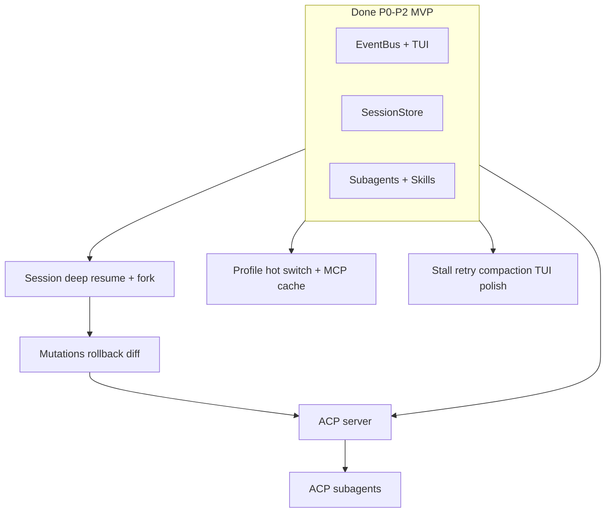

# OpenJiuWen iCode ↔ Chrys 差距与迁移计划

| 项 | 值 |
|---|---|
| 日期 | 2026-08-10 |
| 原则 | EventBus 壳 + **DeepAgent 核**；**不**移植 Chrys kernel / 整仓拷贝（Python 版本与双运行时冲突） |
| 权威 backlog | [chrys-migration-todo.md](chrys-migration-todo.md) |
| 特性索引 | [chrys-non-tui-features/README.md](chrys-non-tui-features/README.md) |
| Chrys 参考仓 | `/Users/michael/github/chrys` |

---

## 1. 执行摘要

**已完成（P0–P2 MVP + icode_porting 增量）：** iCode 已是可日常使用的 Chrys 风格编程助手——EventBus + Textual TUI、SessionHost 后台 turn、审批/提问 Modal、inject/interrupt/retry、Sessions/Models 模态、Messages/Tasks/Context 侧栏、subagent 卡片与 abort/retry/audit、skills 多路径、workdirs 多目录、session 原子写与标题、OpenCode 导出与 `events.jsonl` 轨迹等。

**与 Chrys 仍显著差距集中在（刻意延后 / 可选）：**

1. **Team / Bridge 只读 fan-in**（T-32/33）  
2. **VirtualizedMarkdown / 大历史性能**（T-46）  
3. **AUTO approval judge**（T-28，明确延后）  
4. **doc_converter / shell filter 全量对照**（T-42/47）  
5. ~~**`chrys serve` 浏览器 TUI**~~ → ✅ `openjiuwen serve` MVP  

**本轮计划（A–E）已落地 MVP：** Session resume/fork/元数据、profile 热切换、MCP cwd+hash + tools、Models 高级表单、`openjiuwen acp`、ACP `transport=acp`、MutationTracker `/diff` `/rollback`、stall 重试、`/theme` `/notifications` `/hooks`。

---

## 2. 架构对照（一句话）

| 层 | Chrys | OpenJiuWen iCode |
|----|--------|------------------|
| 壳 | EventBus + Textual + SessionHost | 同构（`harness/cli/events` + `SessionHost`） |
| 执行核 | Chrys kernel ToolLoop | **DeepAgent** + harness rails（**不移植 kernel**） |
| 配置根 | `~/.chrys` | `~/.icode` / `~/.openjiuwen`（模型等） |
| 工程模型 | 单 workdir + `/chdir` | **多 workdir** + primary 热切换 |

---

## 3. 功能差距表（Chrys → iCode）

图例：**✅ 对齐** · **◐ 部分** · **✗ 未迁** · **➕ iCode 独有** · **— 刻意不做**

### 3.1 运行时与 CLI

| 能力 | Chrys | iCode | 说明 |
|------|-------|-------|------|
| 默认 TUI | ✅ | ✅ | `openjiuwen` / `tui` |
| Headless `run` + stream-json | ✅ | ✅ | BYPASS 审批 |
| `build_host_bundle` 共用 | — | ✅ | run/tui 同路径 |
| `chrys acp` | ✅ | ✅ MVP | `openjiuwen acp` |
| `chrys serve` | ✅ | ✅ MVP | `openjiuwen serve` (textual-serve) |
| 顶层 `agents`/`models` CLI | ✅ | ◐ | 会话内 `/agents use` `/models` |
| OpenCode 导出 | ➕ | ✅ | `/export` + events.jsonl |
| auto-harness | ➕ | ✅ | Chrys 无 |

### 3.2 Session 与持久化

| 能力 | Chrys | iCode | 说明 |
|------|-------|-------|------|
| 列表 / 新建 / 恢复元数据 | ✅ | ✅ | F1 Sessions 模态 |
| 原子写 + recovery | ✅ | ✅ | T-21 |
| 自动 / LLM 标题 + `/title` | ✅ | ✅ | T-44；需防 LLM repr 污染（已修） |
| `/fork` | ✅ | ✅ | A2 |
| Resume = agent 上下文 | ✅ | ✅ | A1 checkpoint 或 store seed |
| Mutation 追踪 | ✅ | ✅ | T-40 `/diff` `/rollback` |

### 3.3 Agent / Model / MCP

| 能力 | Chrys | iCode | 说明 |
|------|-------|-------|------|
| Model profiles + Modal | ✅ | ✅ | F4；高级表单项仍缺 |
| Agent YAML + sub_agents | ✅ | ✅ | 加载 + roster + `/agents use` |
| `/agents` 八 tab 配置 | ✅ | ◐ | list + use；无八 tab UI |
| MCP 客户端 | ✅ | ✅ | `~/.icode/mcp.json` |
| MCP cwd+hash 缓存 | ✅ | ✅ | T-24 稳定 server_id |
| MCP 渐进披露 list/load | ✅ | ◐ | `/mcp tools` |

### 3.4 人机与控制

| 能力 | Chrys | iCode | 说明 |
|------|-------|-------|------|
| MANUAL 审批 | ✅ | ✅ | Modal |
| BYPASS headless | ✅ | ✅ | |
| AUTO LLM judge | ✅ | ✗ T-28 | 刻意延后 |
| inject / interrupt / retry | ✅ | ✅ | P1 |
| `/compact` + 事件 | ✅ | ◐ | 四阶段语义部分对齐 |
| 主 turn stall 重试 | ✅ | ✅ | T-43 |
| 外部 Hooks | ✅ | ◐ | `/hooks` 发现 stub |

### 3.5 Subagents

| 能力 | Chrys | iCode | 说明 |
|------|-------|-------|------|
| task / spawn / 并发 | ✅ | ✅ | |
| TUI 卡片 + abort/retry | ✅ | ✅ | icode_porting |
| audit JSONL | ✅ | ✅ | `sub_agents.jsonl` |
| 内嵌 tool 时间线 | ✅ | ✅ | SubAgentCard |
| ACP 外部子 agent | ✅ | ✅ MVP | T-31 `transport=acp` |

### 3.6 TUI 产品面

| 能力 | Chrys | iCode | 说明 |
|------|-------|-------|------|
| Messages TOC | ✅ | ✅ | |
| Tasks (todo) | ✅ | ✅ | |
| Context 用量 | ✅ | ✅ | resume 后 seed |
| `/theme` `/notifications` | ✅ | ✅ | E5 偏好持久化 |
| `/man` 帮助屏 | ✅ | ◐ | `/help` 文本 |
| Buddy | ✅ | — T-45 | 默认不迁 |
| VirtualizedMarkdown / 大历史 | ✅ | ✗ T-46 | |
| Runtime 详情对话框 | ✅ | ◐ | `/status` + Context |
| Diff / rollback Modal | ✅ | ◐ | slash `/diff` `/rollback` |

### 3.7 Skills / 工具 / 其他

| 能力 | Chrys | iCode | 说明 |
|------|-------|-------|------|
| Skills 多路径（含 ~/.chrys/skills） | ✅ | ✅ | T-07 |
| 内置工具面 | ✅ | ✅ | harness 更广 |
| doc_converter | ✅ | ✗ T-42 | |
| Shell filter 规则集 | ✅ | ◐ T-47 | |
| Vision | ✅ | ✅ | env 门控 |
| OTEL | ✅ | ◐ | core 扩展，非 Chrys 布局 |
| Kernel loop | ✅ | — | DeepAgent 替代（27） |

---

## 4. icode_porting 已落地、文档待同步项

在 [chrys-migration-todo.md](chrys-migration-todo.md)（2026-08-03）之后，分支上建议记入「已完成」：

- SubAgent 卡片 Retry/Abort、auto-retry、`SubAgentRetryAttempt` 横幅  
- SubAgent 内嵌 tool 调用展示  
- Context 侧栏 + resume 后 usage 估算  
- OpenCode 兼容 `/export` + `sessions/<id>/events.jsonl`  
- 导出 `agent_profile` / `harness.product`；会话 title 防 LLM repr  

维护时勾选 todo 并更新对应 `features/NN-*.md`。

---

## 5. 迁移计划（分阶段）

### 阶段 A — Session 可信（P2 深化）【约 2–3 周】

**目标：** 用户认为「恢复会话 = 继续干活」，而非仅看到旧聊天记录。

| 任务 | 依赖 | 验收标准 | 状态 |
|------|------|----------|------|
| A1 统一 resume 语义 | SessionStore, checkpointer | `/resume` 文档 + 行为：至少 replay 或加载 checkpointer 之一为默认；集成测试 | ✅ |
| A2 `/fork` | A1 | 从当前 session 克隆 id + 元数据 + 可选 checkpointer 分支 | ✅ |
| A3 Session 元数据 | — | 持久化 `agent_profile`、model、workdir（部分已有）；导出/列表一致 | ✅ |

**风险：** DeepAgent 与 StoredMessage 双源真相；需单一「会话恢复策略」文档。

---

### 阶段 B — Agent / MCP 产品对齐（P2 增强）【约 2 周，可与 A 并行】

| 任务 | 依赖 | 验收标准 | 状态 |
|------|------|----------|------|
| B1 Agent profile 热切换 | profile_loader, factory | `/agents use <id>` → rebuild DeepAgent + `ProfileSwitched` | ✅ |
| B2 MCP cwd+hash 缓存 | T-24 | 同目录同配置不重复握手；`/mcp` 显示 cache 状态 | ✅ |
| B3 MCP 渐进披露 | B2 | list_tools / owned tools 与 Chrys 文档对齐的 UX 或 slash | ✅ `/mcp tools` |
| B4 Models Modal 高级项 | settings | headers、extra_body、env 密钥编辑（对齐 Chrys 表单） | ✅ |

---

### 阶段 C — 编辑器协作（P3）【约 3–4 周】

| 任务 | 依赖 | 验收标准 | 状态 |
|------|------|----------|------|
| C1 **T-30 ACP Server** | SessionHost | `openjiuwen acp`：session new/load/list/prompt/cancel；stdout 仅 JSON-RPC；契约测试 | ✅ MVP |
| C2 **T-31 ACP 子 agent** | C1, profiles | profile `transport: acp`；SubAgent* 带 `transport=acp` | ✅ MVP |
| C3 Bridge 外部 CLI（可选 T-33） | EventBus | 外部进程进度只读 fan-in | 延后 |

**风险：** stdout 污染、与 TUI 双入口争用 SessionHost。

---

### 阶段 D — 安全与可逆编辑（P4 高价值）【约 2–3 周】

| 任务 | 依赖 | 验收标准 | 状态 |
|------|------|----------|------|
| D1 **T-40 MutationTracker** | turn 边界 | 每 turn 记录 fs/shell 变更 | ✅ |
| D2 `/diff` | D1 | TUI/ slash 展示 turn diff | ✅ |
| D3 `/rollback` | D1 | 按 turn 回滚文件（git 优先，无 git 快照目录） | ✅ |
| D4 ACP rollback 扩展 | C1, D3 | 可选；编辑器侧回滚 API | 延后 |

---

### 阶段 E — 稳定性与体验（P4 + TUI）【持续】

| 任务 | 依赖 | 验收标准 | 状态 |
|------|------|----------|------|
| E1 **T-43** 主 turn stall 重试 | stream | 与 24-stream-stall-retry 对齐 | ✅ |
| E2 Compaction 四阶段对齐 | context_engine | turn 边界 + last_words；与 `/compact` 一致 | ◐ 文档+事件 |
| E3 **T-28** AUTO judge（可选） | approval | `/approval auto` + LLM judge | 延后 |
| E4 **T-46** 大历史 TUI | Textual | VirtualizedMarkdown 或性能预算 | 延后 |
| E5 TUI：theme、notifications、runtime 详情 Modal | — | 按 Chrys 优先级逐项 | ✅ `/theme` `/notifications` |
| E6 **T-41** Hooks | — | 子进程；**不可**代批 | ◐ `/hooks` 发现 |
| E7 **T-42** doc_converter | — | 可选依赖 | 延后 |
| E8 **T-47** shell filter | — | 规则集对照 | 延后 |

**明确不做：** Chrys kernel 移植（27）、Buddy（T-45）、整仓拷贝 `src/chrys`。

---

## 6. 依赖关系（简图）

---

## 7. 建议接下来（可选增强，2026-08-10 修订）

计划阶段 **A–E 核心项已完成 MVP**。后续按需：

1. T-46 VirtualizedMarkdown / 大历史性能预算  
2. Compaction 四阶段与 force API 完全对齐  
3. T-32/33 Team / Bridge 只读 fan-in  
4. T-42 doc_converter、T-47 shell filter  
5. ACP 扩展：rollback/mutations 编辑器 API、完整 `agent-client-protocol` 包对齐  

---

## 8. 维护约定

1. 完成项：更新 [chrys-migration-todo.md](chrys-migration-todo.md) + 对应 [features/*.md](chrys-non-tui-features/features/)。  
2. 本计划每季度或每个大里程碑修订「§3 差距表」与「§7 前五项」。  
3. 范围变更先改 [chrys-migration-execution.md](chrys-migration-execution.md)。

---

## 9. 参考路径

| 资源 | 路径 |
|------|------|
| iCode CLI README | `openjiuwen_icode/README.md` |
| Slash 命令 | `openjiuwen_icode/host/commands.py` |
| Chrys slash 注册 | `chrys/app/tui/screens/main/commands.py`（参考仓） |
| OpenCode 导出 | `openjiuwen_icode/export/opencode.py` |
